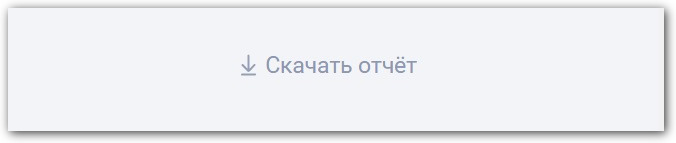
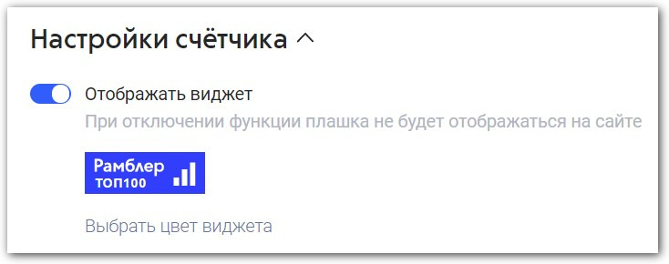

# Частые вопросы и обратная связь

### **Зачем мне знать статистику своего сайта?**

Оценка посещаемости сайта поможет правильно оценить эффективность стратегии продвижения ресурса. Вы сможете выявить слабые места и вовремя их устранить, определить целевую аудиторию, узнать, какие действия пользователи совершают на сайте, сколько времени посетители проводят на ресурсе, какие страницы они просматривают. На основе этих данных можно менять и совершенствовать план продвижения своего сайта.

### **Как выгрузить отчет о посещаемости?**

Вы можете скачать отчет в формате CSV и XLSX. Для этого нажмите кнопку рядом с названием нужного отчета.

<figure><figcaption></figcaption></figure>

Если загрузка не началось сразу, то ссылка на готовый отчет будет отправлена вам по почте.

При этом в отчете сохранятся все настройки сортировки и фильтров (для плоских отчетов) или только фильтров (для древовидных), выбранные вами непосредственно на странице статистики.

### **Какая аудитория посещает мой сайт?**

Проанализировать своих посетителей можно в группе отчетов «Аудитория». К ней относятся отчеты, показывающие демографические характеристики аудитории вашего сайта, например, распределение по полу и возрасту, географию посещений, а также интересы пользователей.

### **С каких страниц пользователи чаще уходят?**

Проанализировать с каких страниц посетители покидают сайт можно при помощи «Страниц выхода». На странице «Монитор» отображается топ-6 URL страниц выхода. Также информацию о страницах сайта, на которых заканчиваются визиты, можно найти в отчетах группы «Содержание» → «Страницы выхода».

### **Как посмотреть, сколько времени посетители проводят на моем сайте?**

В этом вам поможет отчет «Время на сайте». Для того чтобы найти данный отчет, нужно зайти в отчеты группы «Аудитория» → «Время на сайте».

Здесь вы сможете увидеть среднее время присутствия посетителя на страницах вашего сайта с группировкой по интервалам.

### **Какие поисковые фразы привели ко мне посетителей?**

Для того чтобы узнать, какие поисковые фразы и слова привели посетителей на сайт, нужно посмотреть отчет «Поисковые фразы», который находится в группе отчетов «Источники».

Также в данном отчете можно увидеть, в каких именно поисковых системах был осуществлен поиск по конкретному запросу. Следует учитывать, что поисковые системы шифруют большую часть запросов и не передают ее в открытом для считывания виде.

### **Как сравнить показатели моего сайта с показателями похожих ресурсов?**

Для этого следует зайти в отчет «Рейтинг». Здесь вы сможете сравнить позицию вашего сайта в рейтинге с позицией «соседей».

Можно переключаться между темами (если сайт привязан к нескольким темам/подтемам), сами сайты в рамках темы можно упорядочить по популярности, посетителям или просмотрам. При этом сравнение по позиции и популярности доступно для всех сайтов, участвующих в рейтинге, а сравнение по посетителям и просмотрам доступно только для сайтов, открывших свою статистику в настройках.

### Как включить опцию «Участие в рейтинге»?

1\. В **Личном кабинете** нажмите кнопку **Участвовать** в строке сайта, который вы хотите включить в рейтинг. Если сайт с таким URL уже участвует рейтинге, то кнопка будет неактивна.\
2\. На открывшейся странице введите следующие данные:

* Тема
* Тип (если нужен)
* Ключевые слова

3\. Сохраните изменения. После этого сайт будет отправлен на модерацию.\

Модерация занимает до 15 рабочих дней. Текущий статус вашего сайта вы можете увидеть в столбце **Рейтинг**. Подробнее читайте в подразделе «[Участие в рейтинге](nachalo-raboty-s-top-100/uchastie-v-reitinge/)».

### Как поменять метаданные участвующего в Рейтинге Ресурса?

После успешного прохождения модерации, блокируется возможность самостоятельного изменения следующих метаданных:

* Название
* Ключевые слова
* Тема
* Тип
* Регионы (География)

Чтобы изменить эти метаданные, в **Личном кабинете** нажмите на ссылку **Настройки рейтинга** в выпадающем меню в строке интересующего вас сайта. Откроется окно редактирования метаданных. Измените все необходимые поля и нажмите кнопку **Сохранить**. После этого автоматически будет сформирована заявка в службу поддержки, а поля метаданных будут заблокированы для проверки редактором.

Обращаем ваше внимание, что после сохранения данных блокируются все поля, а не только те, которые вы изменили, поэтому внимательно заполните все необходимые метаданные, прежде чем нажать кнопку **Сохранить**.

Если предложенные вами метаданные соответствуют требованиям сервиса, то редактор внесет необходимые изменения, а на вашу почту придет уведомление о том, что метаданные изменены.

В противном случае вы получите письмо, объясняющее причину отказа или содержащее вопросы или комментарии редактора.

Вы также можете отключить опцию **Участие в рейтинге** и изменить метаданные самостоятельно, однако после этого ресурс будет вновь отправлен на модерацию (занимает до 15 рабочих дней) и на редакцию, в ходе которой метаданные будут проверены на соответствие требованиям сервиса и при необходимости изменены.

### **Как узнать позицию моего сайта в рейтинге за один клик?**

Для того чтобы узнать позицию в рейтинге за один клик, нужно разместить виджет Топ-100 на своем сайте. Для этого необходимо перейти в «Настройки счетчика» и включить функцию «Отображать виджет». На сайте появится плашка «Рамблер/топ-100». При нажатии на которую, будет открываться позиция вашего ресурса в рейтинге.

<figure><figcaption></figcaption></figure>

### Как изменить URL сайта?

Воспользуйтесь [формой обратной связи](https://help.rambler.ru/feedback/top100/). В письме укажите:

* старый URL сайта;
* новый URL сайта;
* номер счётчика в Рамблер/Топ-100.

Введите e-mail, на который хотите получить ответ, и нажмите кнопку «Продолжить».

Проверьте введенную информацию, введите символы с картинки и нажмите кнопку «Отправить».

Дождитесь ответа технической поддержки.

### Обратная связь

Если решения вашего вопроса не найдено, обратитесь в [службу поддержки](https://help.rambler.ru/feedback/top100/).
