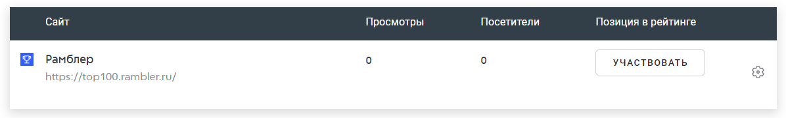
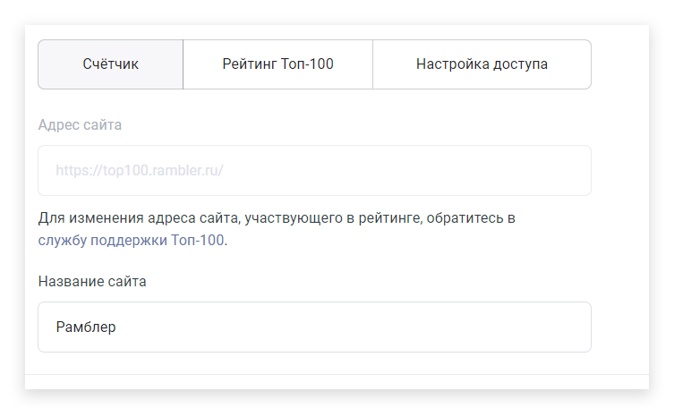
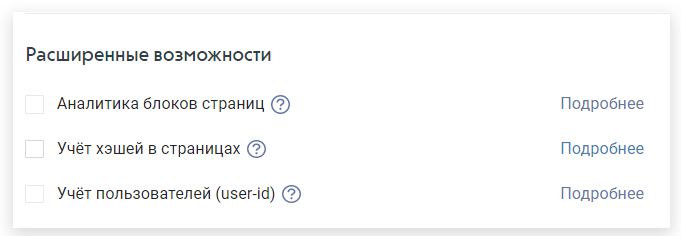
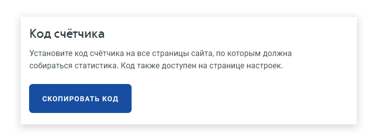

# Настройка счётчика

## Как изменить настройки счётчика

В разделе «Мои сайты» вы можете внести изменения в уже созданные счетчики. Для этого нажмите на шестеренку напротив сайта, в настройки которого вы хотите внести изменения.

<figure><figcaption>
Пример раздела «Мои сайты»
</figcaption></figure>


Обратите внимание! Настройка счётчика доступна только для пользователей с полным доступом к проекту.


### **Адрес и название сайта**

С помощью вкладки «Настройки счетчика» вы можете изменить название своего сайта в любое время. Также, если у вас поменялся адрес сайта, обратитесь в службу поддержки Топ-100 через специальную [форму](https://help.rambler.ru/feedback/top100/), в которой укажите ID счетчика и новый URL. Ваша заявка будет рассмотрена в ближайшее время.

<figure><figcaption>
Пример заполнения адреса и названия сайта
</figcaption></figure>

### **Отображение виджета**

Если вы хотите, чтобы плашка Рамблер Топ-100 присутствовала на вашем сайте, включите опцию «Отображать виджет». Здесь вы также можете поменять цвет виджета.

<figure><figcaption></figcaption></figure>

### **Дополнительные домены**

При создании и настройке счетчика вы можете указать до 10 дополнительных доменов, которые будут считаться синонимами сайта. Укажите доменное имя и проставьте нужные вам галочки:

<figure><figcaption>
Пример заполнения дополнительных доменов
</figcaption></figure>

#### Учитывать поддомены&#x20;

Все домены второго уровня и выше указанных доменов будут считаться частью сайта при расчете статистики. Это нужно для того, чтобы переходы по доменам низших уровней учитывались корректно. Необходимо, чтобы на каждом из них также стоял счетчик

#### Показывать в статистике данные только с указанных доменов&#x20;

В статистике будут учитываться только данные с указанных адресов, независимо от того, на каких еще страницах установлен счетчик.

#### Считать раздельно URL с www и без&#x20;

В отчетах группы «Содержание» страницы с «www» будут учитываться отдельно.

#### Исключить из статистика данные со следующих доменов&#x20;

Данные, поступающие с указанных адресов, не будут учитываться в статистике. Например, вы можете указать адрес тестовой версии сайта.

### **Расширенные возможности**

Выберите нужные вам функции:

<figure><figcaption></figcaption></figure>


При выборе расширенных возможностей изменяется код счетчика


#### Аналитика блоков страниц&#x20;

Разметка блоков data-атрибутами позволяет получить подробную статистику по кликабельности элементов страниц сайта. Данные доступны в отчете «Аналитика блоков». Подробнее об аналитике блоков вы можете почитать(подключение и настройка аналитики блооков) (ССЫЛКА)

#### Учет хэшей в страницах&#x20;

Настройка для SPA-приложений, использующих hash параметры в качестве идентификаторов страниц. Hash параметры в URL будут учитываться как отдельные страницы, если на странице нет элемента с идентичным id. Иначе параметр будет интерпретирован как якорная ссылка. (ССЫЛКА)

#### Учет пользователей (user-id)&#x20;

для учета авторизованных пользователей необходимо передавать параметр 'user\_id' при инициализации счетчика и впоследствии методом top100Counter.syncUserId(). Если при загрузке страницы со счетчиком пользователь не авторизован, необходимо указать 'user\_id: null'. (ССЫЛКА)

После того, как вы внесете изменения, раздел расширенных возможностей будет выглядеть таким образом:

<figure><figcaption>
Пример заполнения расширенных возможностей
</figcaption></figure>

В код счетчика добавятся параметры «attributes\_dataset», «trackHashes», «user\_id»:

<figure><figcaption>
Пример счетчика
</figcaption></figure>

### **Код счетчика**

Cкопируйте код счетчика, для того, чтобы разместить его на своем сайте. Для корректного подсчета статистики необходимо установить код на все страницы сайта. Код можно встроить в любое место HTML-кода, желательно в начало страницы, чтобы счетчик успел загрузиться при коротких визитах.

<figure><figcaption></figcaption></figure>


Обязательно сохраните изменения, которые вы внесли в настройки счетчика, с помощью кнопки «Сохранить изменения» внизу страницы.

