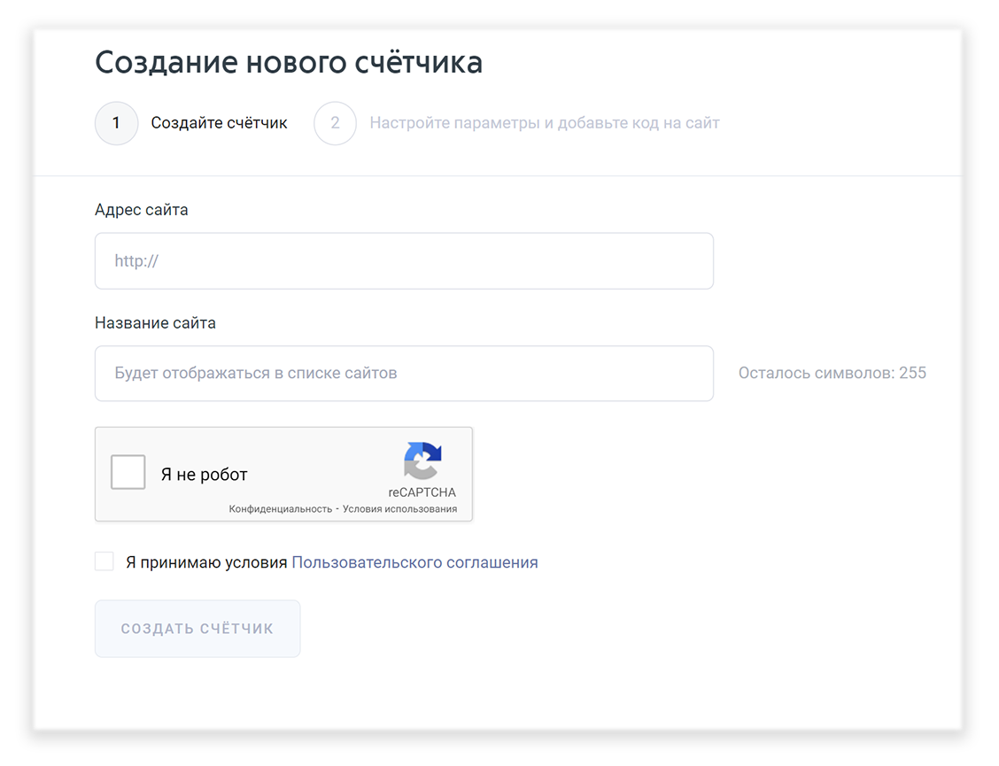
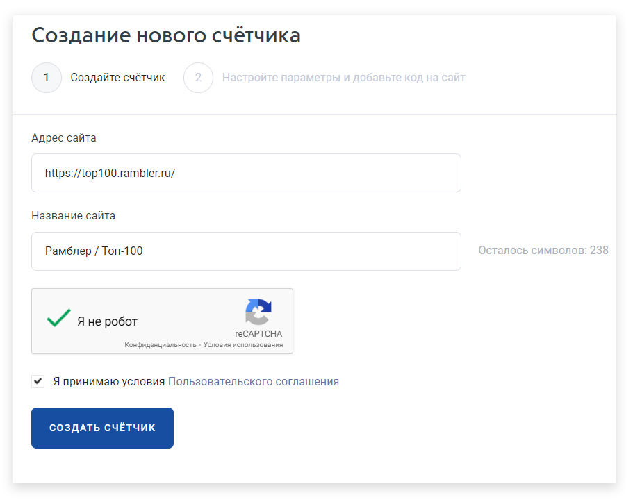

# 1-ый этап создания счётчика

В результате предыдущих действий откроется окно «Создание нового счётчика».&#x20;

<figure><figcaption></figcaption></figure>

**Заполните необходимые строки:**

* **Адрес сайта**

В качестве адреса сайта в соответствующей строке укажите доступный адрес сайта или ссылку на приложение Google Play/App Store, если вы регистрируете Andoid/iOS SDK. В будущем ссылку на сайт можно будет изменить, обратившись в [службу поддержки](https://help.rambler.ru/feedback/top100/).


Если при регистрации выдается сообщение вида «URL сайта не уникален», значит, указанный сайт уже был зарегистрирован, и счётчик для него уже создан. Если вы по каким-то причинам потеряли доступ к этому счётчику и хотите перерегистрировать сайт, воспользуйтесь [восстановлением счётчика](../vosstanovlenie-dostupa-k-schetchiku.md) или [обратитесь в поддержку](https://help.rambler.ru/feedback/top100/).


* **Название сайта**

Название сайта в поле подгружается автоматически. По желанию вы можете его изменить. Указанное название будет отображаться [в перечне подключенных счётчиков](http://stat.top100.rambler.ru/projects/). А также [в каталоге Топ-100](http://top100.rambler.ru/), если в настройках счётчика будет проставлен признак участия в рейтинге.

### Пример заполнения

Для примера мы создали счётчик на сайт Топ-100. После успешного прохождения reCARTCHA и принятия условий Пользовательского соглашения кнопка «Создать счётчик» станет активной.

<figure><figcaption>
Пример заполнения адреса и названия сайта
</figcaption></figure>

В результате Топ-100 сохранит счётчик и присвоит ему уникальный идентификатор. Осуществится автоматический переход на [2-ой этап создания счётчика](2-oi-etap-sozdaniya-schyotchika.md)
