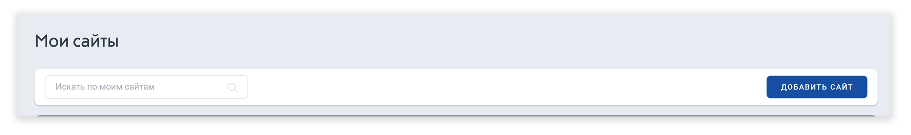

# Создание Счётчика Топ-100

После регистрации на сайте вы можете создать счетчик через [форму создания нового счетчика](https://stat.top100.rambler.ru/create).&#x20;

Вы также можете установить счетчик через [главную страницу](https://top100.rambler.ru/) Рамблер/Топ-100. Для этого соблюдайте следующую инструкцию:

**Шаг 1.** Откройте [главную страницу](https://top100.rambler.ru/) Рамблер/Топ-100 и кликните на иконку «Мои сайты», которая находится справа от строки поиска.

<figure><figcaption></figcaption></figure>

**Шаг 2.** Далее нажмите на кнопку «Добавить сайт»

<figure><figcaption></figcaption></figure>

**Шаг 3.** В результате откроется окно «Создание нового счетчика». Переходите к [первому этапу](1-yi-etap-sozdaniya-schyotchika.md) создания счётчика.
