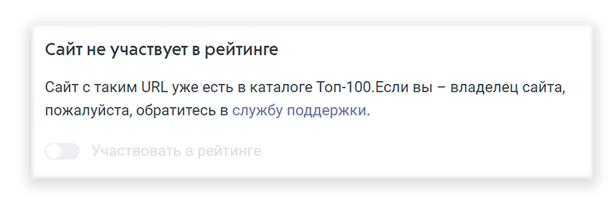
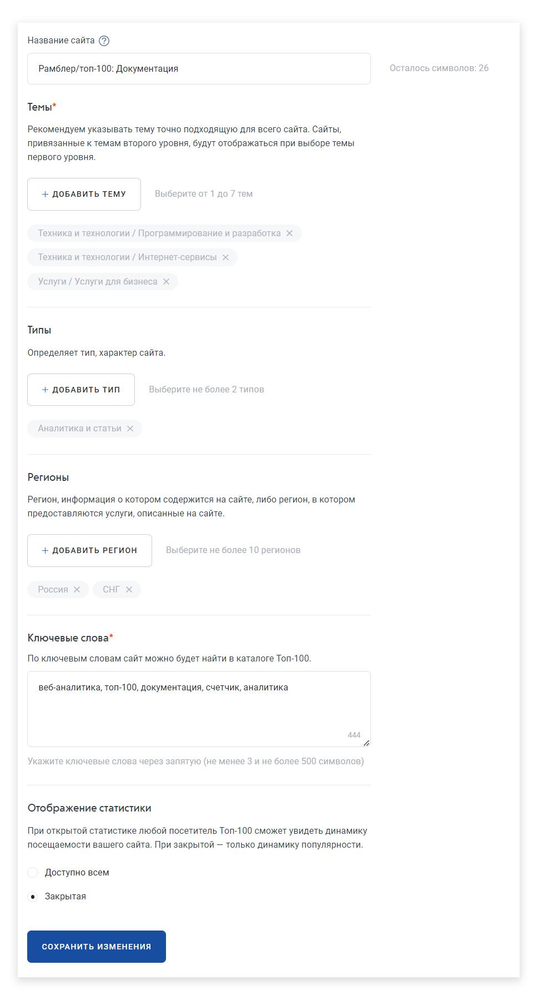
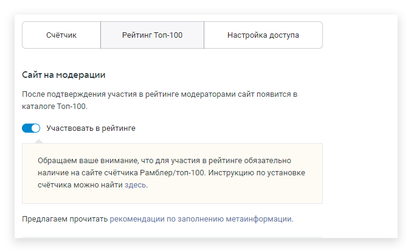

# Участие в рейтинге

## Участие в Рейтинге Топ-100

После установки счётчика вы можете включить опцию «Участвовать в рейтинге». Для этого нажмите на шестеренку напротив сайта, который вы хотите включить в рейтинг.

<figure><figcaption></figcaption></figure>


**ВНИМАНИЕ!** Участие в рейтинге доступно только при установленном на сайте счётчике


**Шаг 1.** В Личном кабинете нажмите кнопку «Участвовать» в строке сайта, который вы хотите включить в рейтинг. Если сайт с таким URL уже участвует рейтинге, то кнопка будет неактивна.

<figure><figcaption></figcaption></figure>

**Шаг 2.** На открывшейся странице введите следующие данные:

1. Название сайта.&#x20;
2. Тема. Укажите одну или несколько категорий (см. [рекомендации по выбору темы](rekomendacii-po-vyboru-temy.md)).
3. Тип (см. [рекомендации по выбору типа](rekomendacii-po-vyboru-tipa.md)).
4. Регионы (см. [рекомендации по выбору региона](rekomendacii-po-vyboru-regiona.md))
5. Ключевые слова.
6. Отображение статистики: доступна всем или закрытая. При раскрытии статистики любому посетителю Топ-100 будет доступен отчет «Посещаемость», «Популярность» и отчет «Сегодня» с данными по посетителям, визитам и просмотрам.

<figure><figcaption>
Пример заполнения данных для участия в рейтинге
</figcaption></figure>


Обратите внимание на правила [редакционной политики](redakcionnaya-politika-rambler-top-100.md), из-за которых вам может быть отказано в участии в рейтинге.


**Шаг 3.** Сохраните изменения. После этого сайт будет отправлен на модерацию.\
Модерация занимает до 15 рабочих дней. Текущий статус вашего сайта вы можете увидеть в столбце Рейтинг.

<figure><figcaption></figcaption></figure>
