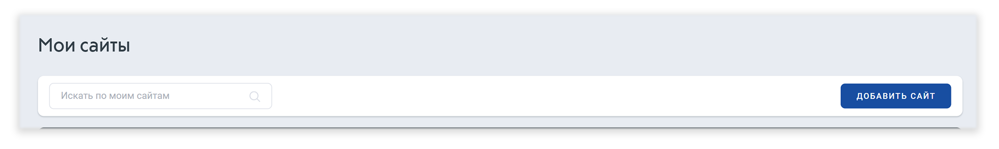
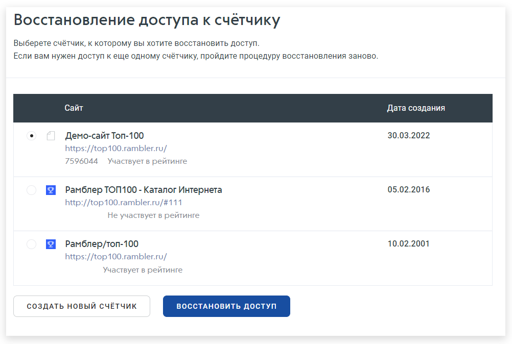

# Восстановление доступа к счетчику

**Шаг 1.** Для того, чтобы восстановить доступ к счетчику, нажмите кнопку «Добавить сайт»

<figure><figcaption></figcaption></figure>

**Шаг 2.** Введите адрес сайта, доступ к которому необходимо восстановить. Проставьте галочки в reCAPTCHA и примите пользовательское соглашение. Завершите действие кнопкой «Создать счетчик»

<figure><figcaption></figcaption></figure>

**Шаг 3.** Выберете счетчик, к которому хотите восстановить доступ.

<figure><figcaption></figcaption></figure>

**Шаг 4**.  Нажмите на кнопку «Восстановить доступ». Если вы хотите создать новый счетчик, кликните на соответствующую плашку.&#x20;

<figure><figcaption></figcaption></figure>

**Шаг 5.** После всех действий к вам на почту придет файл, который вы должны разместить на своем сайте в течение семи дней. После чего наш робот проведет проверку и выдаст доступ.

<figure><figcaption></figcaption></figure>


Если у вас остались вопросы по восстановлению счетчика, задайте их в форме [обратной связи](https://help.rambler.ru/feedback/top100/). Обязательно укажите ID счетчика и URL вашего сайта. Поддержка Рамблер/Топ-100 рассмотрит заявку в ближайшее время.

