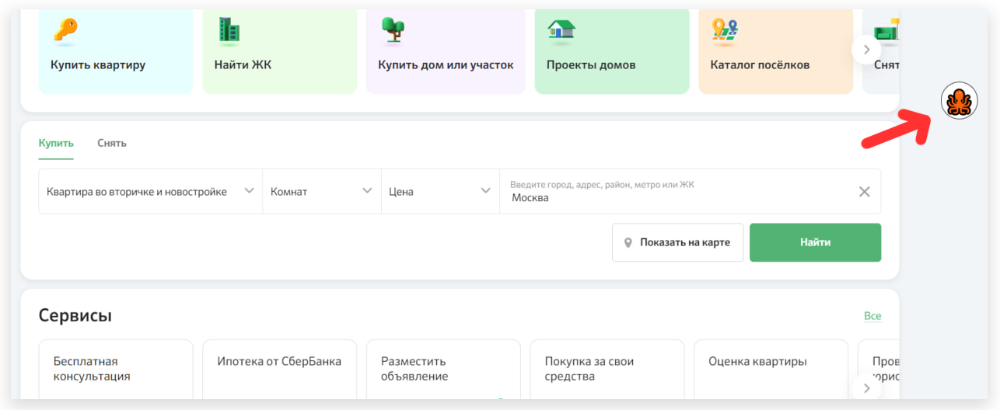

# Debug режим счётчика

Debug-режим позволяет проверить корректность работы счетчика и его параметры. Для того чтобы его активировать, добавьте в GET-параметр ?**\_top100\_debug=1**

После включения debug-режима на странице сайта отобразится эмблема кракена.

<figure><figcaption></figcaption></figure>

В DevTools во вкладке Console появится логирование событий, где будет информация о названии счетчика, его параметрах и действиях.&#x20;

<figure><figcaption></figcaption></figure>

Вы также можете выбрать – показывать ли блоки, если вы используете аналитику блоков. Для активации нажмите на иконку Кракена на сайте.

<figure><figcaption></figcaption></figure>


Обратите внимание! Функционал может работать нестабильно при включенном блокировщике рекламы.


Для того чтобы выключить debug-режим, добавьте в GET-параметр **\_top100\_debug=0**
