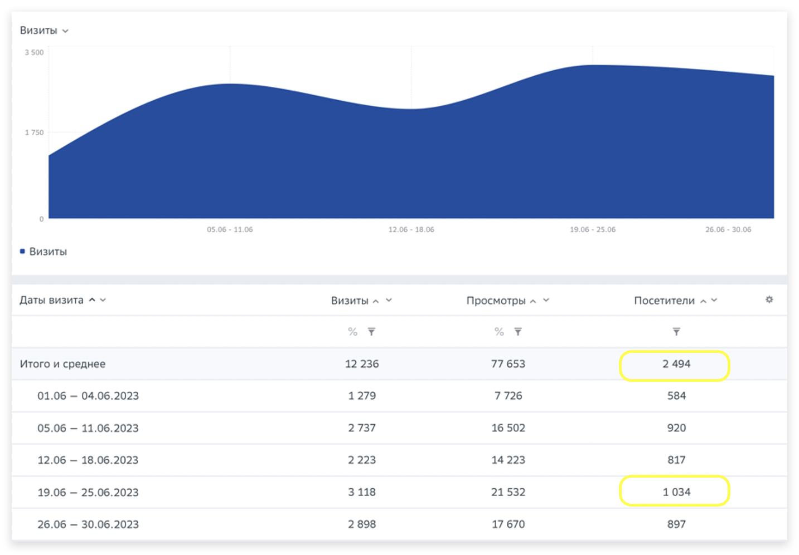

# Кейсы

### Как сделать, чтобы один и тот же посетитель засчитывался только один раз?&#x20;

**Кейс**: Реальная численность сотрудников – 857 человек. Но если смотреть отчет «Посещаемость», критерий фильтрации – атрибут «принадлежность к компании», то посещаемость за неделю составляет 1034 человек. Эта цифра больше, чем вся численность сотрудников. Почему так и как это можно исправить?&#x20;

<figure><figcaption></figcaption></figure>

**Ответ:** Мы ориентируемся на Cookie, поэтому, если один и тот же пользователь посещает сайт с разных устройств (например, с рабочего ноутбука, домашнего ноутбука и телефона), то каждый такой визит будет засчитываться как отдельный посетитель. Если вы хотите, чтобы один и тот же посетитель засчитывался в таком случае только один раз, необходимо передать параметры запроса publisher\_uid\_scope или auth\_uid (для авторизованных пользователей). Подробнее о том, как это сделать, читайте в разделе "[Базовые параметры запроса](https://top-100-writer.gitbook.io/dokumentaciya-top-100-po-novoi-modeli-progress/nastroika-sbora-i-otpravki-dannykh/otpravka-dannykh-s2s/bazovye-parametry-zaprosa)" и "[Отправка данных S2S](https://top-100-writer.gitbook.io/dokumentaciya-top-100-po-novoi-modeli-progress/nastroika-sbora-i-otpravki-dannykh/otpravka-dannykh-s2s)". Обратите внимание, после того, как вы настроите параметр запроса, будут корректироваться только новые данные. Старые отчеты с уже существующими данными останутся без изменений.
