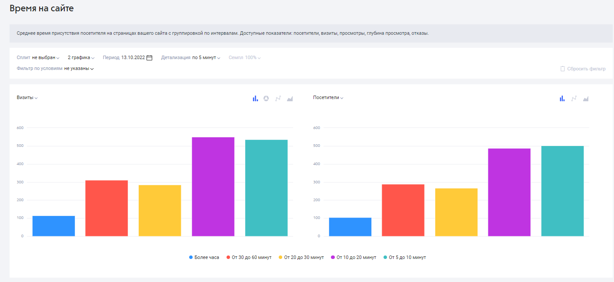

# Аудитория

Отчеты этой группы показывают общую картину посещаемости сайта за выбранный вами период. Они позволяют вам:

* следить за изменениями посещаемости в режиме реального времени и своевременно принимать меры в случае падения трафика;
* оценить, сколько времени пользователь проводит на сайте, а также количество страниц, которое он просматривает в среднем за одно посещение сайта (глубина просмотра);
* ознакомиться с демографическими характеристиками аудитории вашего сайта: пол и возраст, география посещений, а также интересы пользователей.

<figure><figcaption></figcaption></figure>

### **Посещаемость**

<figure><figcaption></figcaption></figure>

Общий отчет о посетителях, визитах и просмотрах вашего сайта. Доступные показатели: посетители, визиты, пользователи, просмотры, отказы, время на сайте, глубина просмотра.

### Глубина просмотра

<figure><figcaption></figcaption></figure>

Количество просмотров страниц сайта в рамках одного визита с группировкой по количеству страниц. Доступные показатели: посетители, визиты, время на сайте.

### Время на сайте

<figure><figcaption></figcaption></figure>

Среднее время присутствия посетителя на страницах вашего сайта с группировкой по интервалам. Доступные показатели: посетители, визиты, просмотры, глубина просмотра, отказы.

### География

<figure><figcaption></figcaption></figure>

В этом отчете можно проследить региональную принадлежность посетителей сайта с точностью до города, которая определяется по IP. Доступные показатели: посетители, визиты, пользователи, просмотры, отказы, время на сайте, глубина просмотра.

### Пол

<figure><figcaption></figcaption></figure>

Информация о гендерной принадлежности посетителей сайта. Данные получены с помощью технологий машинного обучения. Доступные показатели: посетители, визиты, пользователи, просмотры, отказы, время на сайте, глубина просмотра.

### Возраст

<figure><figcaption></figcaption></figure>

Информация о возрасте посетителей сайта. Данные получены с помощью технологий машинного обучения. Доступные показатели: посетители, визиты, пользователи, просмотры, отказы, время на сайте, глубина просмотра.

### Интересы

<figure><figcaption></figcaption></figure>

Тематические разделы, которые, по версии Модели пользователя Рамблера, также интересны посетителям вашего ресурса.\
Доступные показатели: посетители, отказы, глубина просмотра, визиты, просмотры, время на сайте.
