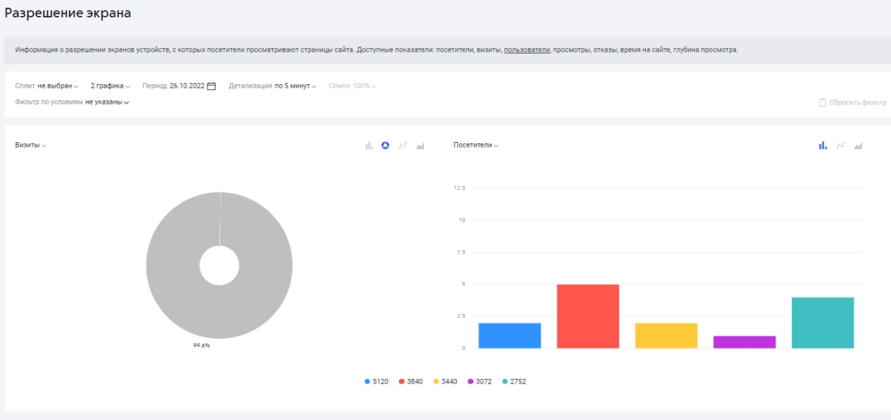
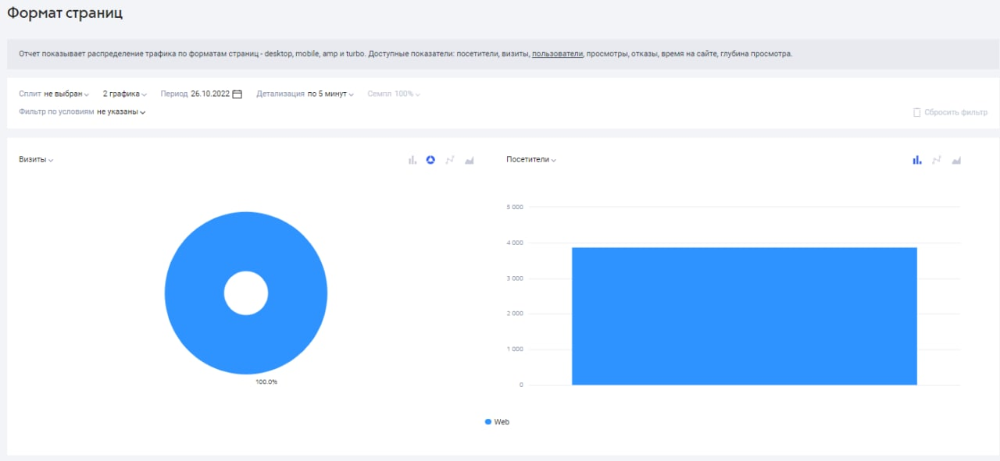

# Технологии

Отчеты этой группы расскажут вам об устройствах, браузерах, операционных системах, которые используют посетители вашего сайта. Они также помогут найти ошибки в мобильной версии вашего сайта.

<figure><figcaption></figcaption></figure>

Доступные показатели отчетов группы «Технологии‎»: посетители, визиты, пользователи, просмотры, отказы, время на сайте, глубина просмотра.

### Устройства

<figure><figcaption></figcaption></figure>

Данные об устройствах, с которых пользователи заходили на сайт.&#x20;

### Браузеры

<figure><figcaption></figcaption></figure>

Браузеры, которыми пользуются посетители вашего сайта.&#x20;

### Операционные системы

<figure><figcaption></figcaption></figure>

Данные о том, какими операционными системами (и их версиями) пользуются посетители вашего сайта

### Разрешение экрана

<figure><figcaption></figcaption></figure>

Информация о разрешении экранов устройств, с которых посетители просматривают страницы сайта.&#x20;

### **Формат страниц**

<figure><figcaption></figcaption></figure>

Отчет показывает распределение трафика по форматам страниц — desktop, mobile, amp и turbo
