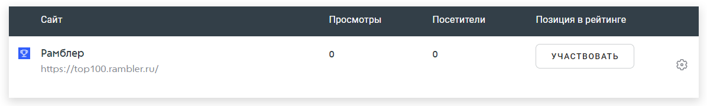

# Конверсии

Конверсия – это один из главных показателей эффективности вашего сайта. С помощью конверсии вы сможете проанализировать глубину просмотра страниц, количество людей, которые отправили форму обратной связи, источники ключевых переходов и другую важную информацию. Сервис Рамблер Топ-100 поддерживает следующие метрики для отслеживания: визиты, посетители и CTR. При этом вы также можете максимально детализировать данные, чтобы узнать, например, пол и возраст посетителей, которые купили определенный товар на вашем сайте. Это лишь малая часть возможности конверсий – все зависит от тематики вашего ресурса.

### **Модели атрибуции**

Перед настройкой сбора конверсии, необходимо настроить модель атрибуции. От выбранной модели будет зависеть, какой источник будет считаться «ответственным» за переход нового пользователя на ваш сайт: поисковики, контекстная реклама, прямой заход, ссылка в материале на другом сайте и т.д. Особенно важно учитывать эти настройки во время рекламных кампаний по продвижению вашего ресурса.

Топ-100 на основе истории переходов посетителя поддерживает следующие модели атрибуции:

* **Первый переход  – first-click**. Учет пользователей ведется по первому контакту пользователя с вашим ресурсом. Источники последующих переходов (даже если при первом переходе не было совершено целевое действие) игнорируются. Эта модель актуальна, если цель вашего продвижения – повысить узнаваемость, а не продажи. Вместе с этим ограничена возможность определить, что повлияло на принятие решения о покупке.
* **Последний переход – last-click**. Здесь основная ценность заключается в источнике, на который пользователь перешел перед тем, как совершить конверсию (например, клик на рассылки с предложением скидки на товар). Вся история взаимодействия посетителя с сайтом «до» не имеет никакого значения.
* **Последний значимый переход – last-valuable**. Все источники делятся на два типа: незначимые и значимые. К незначимым относятся прямые заходы по URL сайта в адресной строке, внутренние переходы по сайту, переход с сохраненных локально на устройстве пользователя страниц. Во всех этих случаях посетитель знает точный адрес сайта или уже знаком с ресурсом. Значимыми переходами считается переход из контекстной и таргетированной рекламы, соцсетей, рассылок, мессенджеров, рекомендательных систем и т.д.
* **Последний переход из SberAds**. Эта модель используется, если нужно оценить эффективность именно этого источника трафика. Все визиты, совершенные после последнего перехода из SberAds, будут приравнены к визитам из рекламной системы Сбербанка.

**По умолчанию в нашей системе установлена модель «Последний переход». Однако так как она не учитывает историю взаимодействия с сайтом, мы не рекомендуем опираться на нее при анализе эффективности каналов трафика. Более детальный анализ источников трафика можно произвести в отчете «Одной конверсии».**\
\
Если вы выбираете другую модель атрибуции, то важно задать окно атрибуции. Это период, в рамках которого происходит анализ действий пользователя. Аналитика поддерживает периоды 7/14/21/28 дней.


Обратите внимание! Конверсии можно создавать как для будущих событий, так и для тех, которые уже произошли. Например, если вы запустили значимые изменения для своего сайта, но не настроили сбор данных – вы всегда можете это сделать позже. Ваши данные не будут утеряны.


### Инструкция по работе с конверсиями

Для начала необходимо завести целевое событие (см. отчет [Целевые события](celevye-sobytiya.md)), по отношению к которому будет рассчитываться конверсия.

**Шаг 1.** Для того чтобы начать работать с конверсиями, зайдите в раздел «Мои сайты» и кликните на наименование сайта, отчеты которого вы хотите посмотреть.

<figure><figcaption>
Пример раздела «Мои сайты»
</figcaption></figure>

**Шаг 2.** Далее выберите раздел «Конверсии». Чтобы завести конверсию, нажмите кнопку «Новая конверсия».

<figure><figcaption></figcaption></figure>

**Шаг 3.** Высветится окно заведения конверсии


Быстро создать конверсию с нужным целевым событием можно через раздел [Целевые события](celevye-sobytiya.md). Просто кликните на плюсик напротив нужной цели.


<figure><figcaption>
Пример заведения конверсии
</figcaption></figure>

Рассмотрим все пункты заведения новой конверсии детально:

**Название**

Введите название вашей конверсии

**Описание**

При необходимости добавьте описание или примечание&#x20;

**Блоки с целями**

Выберите необходимые цели, которые вы заранее создали в отчете [Целевые события](celevye-sobytiya.md).

Далее необходимо выбрать, исходя из какого разреза нужно высчитать конверсии

<figure><figcaption></figcaption></figure>

**Визиты**

Выбирая метрику визитов, в отчете конверсий вы получите долю визитов с целевым действием по отношению ко всем визитам.

**Посетители**

Выбирая метрику посетителей, в отчете конверсий вы получите долю посетителей, совершивших целевое действие по отношению ко всем посетителям сайта.

**Количество событий**

Выберите эту метрику, если хотите посчитать CTR, то есть отношение одного целевого действия к другому. При выборе этой метрики необходимо, чтобы в числителе и знаменателе стояли целевые действия.

**Шаг 4**. После внесения изменений нажмите кнопку «Добавить конверсию».

<figure><figcaption></figcaption></figure>

У каждой конверсии есть своя таблица с данными, в которой высвечивается ее название, процент конверсии и достижения цели. Посмотреть эти данные можно также на графике справа. Те конверсии, которые вы добавили в избранное, будут показываться наверху страницы.

<figure><figcaption></figcaption></figure>

Конверсию можно в любой момент отредактировать, удалить или изменить тип доступа.&#x20;


Обратите внимание, что для изменения типа доступа на общий, цели в данной конверсии также должны иметь общий тип доступа. При этом, сделав доступ публичным, ограничить его в будущем будет невозможно.&#x20;


Кроме того, вы можете выбрать период времени, в течение которого хотите рассчитать конверсию, а также детализацию: по минутам, часам, дням, неделям, месяцам.

