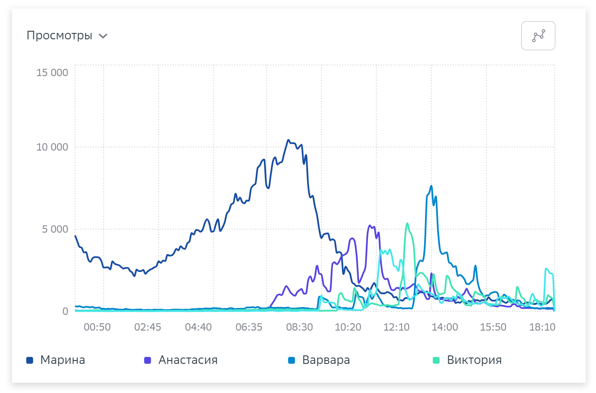

# Отчёт по авторам

С помощью этого отчёта вы можете получить суммарную и усредненную статистику по метрикам материалов, опубликованных разными авторами. Отчет помогает сравнивать результативность и эффективность авторов.&#x20;

Рассмотрим каждый блок подробнее:

<figure><figcaption></figcaption></figure>

* **Настройка периода и фильтра.** Вы можете настроить период времени, семпл, выбрать детализацию по 5 минут или по часам, а также условия, которые вас интересуют. Мы будем рассматривать блоки на примере условий, выбранных по умолчанию.&#x20;

<figure><figcaption></figcaption></figure>

*   **Графики**. Построенные на основе выбранных метрик графики позволяют отследить результаты выбранных авторов в динамике за определенный период времени с заданной детализацией. Доступные метрики: дочтение, доскролл, рециркуляция, время на материале, всего материалов, просмотры, переходы, пользователи, посетители, визиты пользователи Рамблер. Подробное описание метрик читайте в разделе «[Вычисляемые метрики](https://top-100-writer.gitbook.io/dokumentaciya-top-100-po-novoi-modeli-progress/rabota-s-otchyotami-v-analitike-top-100/metriki-analitiki-top-100/vychislyaemye-metriki)».

    По умолчанию графики строятся для пяти авторов с наиболее высокими показателями. Изменить авторов в графиках можно, выбрав их в таблице в нижней части отчета. Также доступен выбор типа [графика](https://top-100-writer.gitbook.io/dokumentaciya-top-100-po-novoi-modeli-progress/rabota-s-otchyotami-v-analitike-top-100/instrumenty-analitiki-top-100/grafiki-i-tablicy).

<figure><figcaption>
Пример графика при выбранной метрике Просмотры
</figcaption></figure>

* **Таблица авторов.** Показывает отсортированную по любой метрике статистику по авторам за выбранный период. В таблице показаны до 20 авторов. Для удобства есть поиск по имени автора.&#x20;

Доступные метрики: просмотры, посетители, всего материалов, время на материале, дочтение, доскролл, рециркуляция, переходы, пользователи, визиты, пользователи Рамблер. Подробное описание метрик читайте в разделе «[Вычисляемые метрики](https://top-100-writer.gitbook.io/dokumentaciya-top-100-po-novoi-modeli-progress/rabota-s-otchyotami-v-analitike-top-100/metriki-analitiki-top-100/vychislyaemye-metriki)».

Вы можете выбрать одновременно до 7 метрик в настройках, однако Источники переходов будут показываться по умолчанию. Это краткая визуализация состава источников переходов на конкретный материал. При наведении курсора на шкалу всплывает подсказка с детальной статистикой (подробнее см. раздел «[Источники трафика](https://top-100-writer.gitbook.io/dokumentaciya-top-100-po-novoi-modeli-progress/rabota-s-otchyotami-v-analitike-top-100/otchyoty-analitiki-top-100/bazovye-otchety/istochniki)»).

<figure><figcaption></figcaption></figure>

При нажатии на имя автора, вы перейдете к «[Отчёту по автору](https://top-100-writer.gitbook.io/dokumentaciya-top-100-po-novoi-modeli-progress/rabota-s-otchyotami-v-analitike-top-100/otchyoty-analitiki-top-100/mediaotchety/otchyot-po-avtoru)».&#x20;
