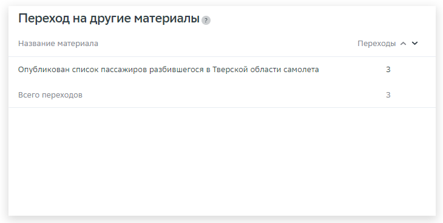

# Отчёт по материалу

Отчёт позволит получить подробную статистику по выбранному материалу. Чтобы попасть на страницу с аналитикой, нажмите на заголовок новости в таблице [Отчёта по материалам](https://top-100-writer.gitbook.io/dokumentaciya-top-100-po-novoi-modeli-progress/rabota-s-otchyotami-v-analitike-top-100/otchyoty-analitiki-top-100/mediaotchety/otchyot-po-materialam).

Рассмотрим каждый блок отчёта подробнее:

<figure><figcaption></figcaption></figure>

* **Краткая информация о материале**. Раздел включает в себя название материала, URL, дату и время публикации, автора материала.

<figure><figcaption></figcaption></figure>

* **Настройка периода и фильтра.** Вы можете настроить период времени, семпл, выбрать детализацию по 5 минут или по часам, а также условия, которые вас интересуют. Мы будем рассматривать блоки на примере условий, выбранных по умолчанию.&#x20;

<figure><figcaption></figcaption></figure>

* **Ключевые метрики.** Основной раздел отчета, демонстрирующий целевые метрики по материалу сайта за выбранный период (по умолчанию показаны метрики за сегодня): дочтение, рециркуляция, время на материале, просмотры, посетители. Подробное описание метрик читайте в разделе [Вычисляемые метрики](https://top-100-writer.gitbook.io/dokumentaciya-top-100-po-novoi-modeli-progress/rabota-s-otchyotami-v-analitike-top-100/metriki-analitiki-top-100/vychislyaemye-metriki).

<figure><figcaption></figcaption></figure>

* **Источники переходов на материалы.** Каждый визит на материал происходит с определенного источника (см. раздел [Источники трафика](https://top-100-writer.gitbook.io/dokumentaciya-top-100-po-novoi-modeli-progress/rabota-s-otchyotami-v-analitike-top-100/otchyoty-analitiki-top-100/bazovye-otchety/istochniki)). Мы сортируем источники по типам и предоставляем по каждому график с различными метриками: визиты, просмотры, посетители, дочтение, доскрол (подробное описание метрик читайте в разделе [Вычисляемые метрики](https://top-100-writer.gitbook.io/dokumentaciya-top-100-po-novoi-modeli-progress/rabota-s-otchyotami-v-analitike-top-100/metriki-analitiki-top-100/vychislyaemye-metriki)). Также доступен выбор визуализации [графика](https://top-100-writer.gitbook.io/dokumentaciya-top-100-po-novoi-modeli-progress/rabota-s-otchyotami-v-analitike-top-100/instrumenty-analitiki-top-100/grafiki-i-tablicy).

<figure><figcaption></figcaption></figure>

* **Аудитория.** Основная демографическая информация о посетителях материала: пол, возраст, страна (подробное описание метрик читайте в разделе [Вычисляемые метрики](https://top-100-writer.gitbook.io/dokumentaciya-top-100-po-novoi-modeli-progress/rabota-s-otchyotami-v-analitike-top-100/metriki-analitiki-top-100/vychislyaemye-metriki)). Также доступен выбор визуализации [графика](https://top-100-writer.gitbook.io/dokumentaciya-top-100-po-novoi-modeli-progress/rabota-s-otchyotami-v-analitike-top-100/instrumenty-analitiki-top-100/grafiki-i-tablicy).

<figure><figcaption></figcaption></figure>

* **Доскроллы и дочтения**. Отчет о вовлеченности читателей в материал. Эта информация поможет понять, насколько материал интересен для аудитории. Подробное описание метрик читайте в разделе [Вычисляемые метрики](https://top-100-writer.gitbook.io/dokumentaciya-top-100-po-novoi-modeli-progress/rabota-s-otchyotami-v-analitike-top-100/metriki-analitiki-top-100/vychislyaemye-metriki).

<figure><figcaption></figcaption></figure>

* **Переход на другие материалы.** Информация о том, на какие материалы переходили посетители после просмотра этого материала. В таблице могут отображаться до десяти ссылок, отсортированных по названию новости и числу переходов на них.

<figure><figcaption></figcaption></figure>
